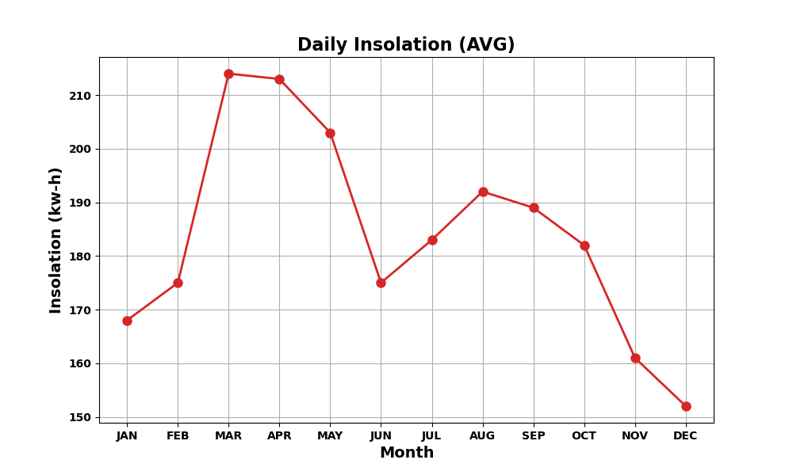
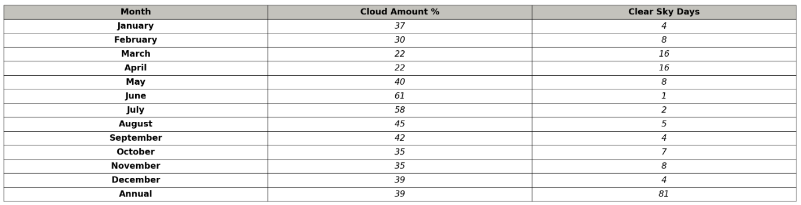
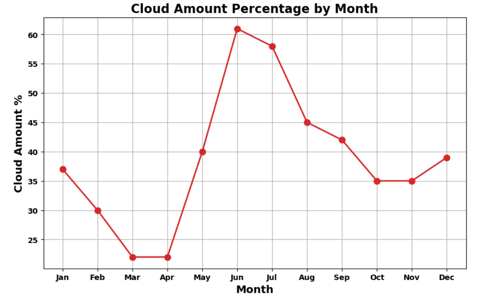
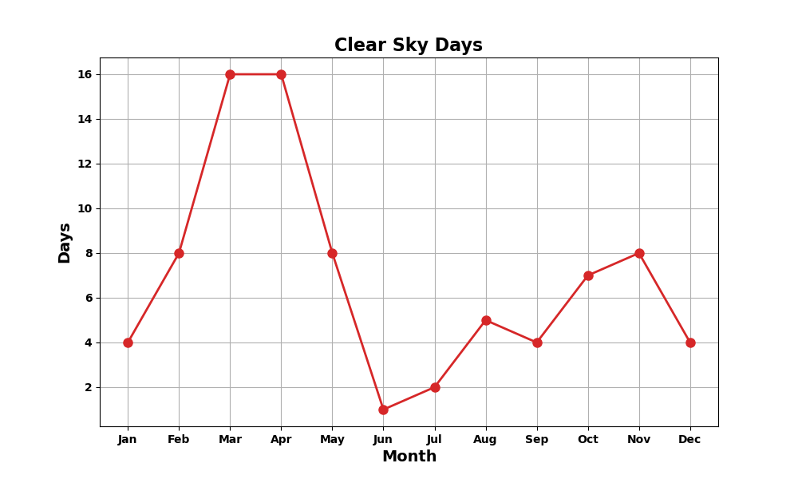

# Solar Panel Farm Optimization Using NASA API Data

## Project Description:

In this project, I used the NASA API to gather data for specific coordinates to identify the optimal location for installing a solar panel farm. The data included solar insolation, cloud coverage, and sky clarity for various points. By analyzing these parameters, I was able to calculate and determine the most advantageous spot for maximizing the efficiency and productivity of a solar farm. This project supports renewable energy initiatives by leveraging precise environmental data to inform strategic decisions on solar farm placements.

## Visualizations

### Daily Insolation (AVG)

This plot shows the average daily insolation (solar energy received) for each month. It highlights the potential solar energy available at the specific location throughout the year. This information is crucial for understanding the seasonal variations in solar energy and for planning the optimal times for energy production.

### Sky Info Table

This table provides detailed information about the sky conditions at the specific coordinates. It includes data such as the amount of cloud coverage and the number of clear sky days. This information helps in assessing the overall sky clarity and the potential impact of cloud coverage on solar energy production.

### Cloud Amount Percentage by Month

This plot shows the percentage of cloud coverage for each month. It provides insights into the monthly variability in cloudiness, which can affect the efficiency of solar panels. Understanding cloud patterns is essential for predicting potential reductions in solar energy output due to cloud cover.

### Clear Sky Days

This plot displays the number of clear sky days each month. Clear sky days are ideal for solar energy production, as they allow for maximum sunlight exposure. This graph helps identify the best months for solar energy generation and can guide the scheduling of maintenance and other activities to maximize productivity.

---

By utilizing these visualizations and data analyses, stakeholders can make informed decisions about where to place solar panel farms to optimize energy production, reduce costs, and contribute to sustainable energy solutions.
